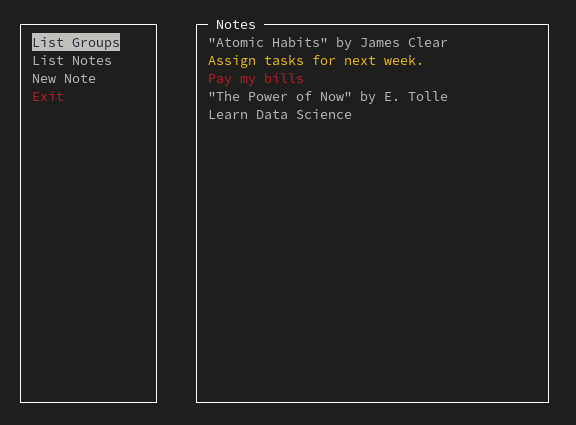
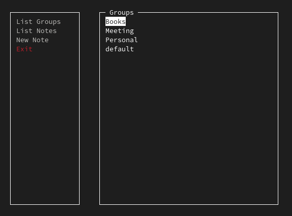

<!-- Images -->
<div style="display: flex;margin-bottom:5%;">
    
    
</div>

# Notes App

## Overview
This is a simple notes app that allows you to add, remove, list and read notes.  
The app now supports notes groups

## News/Updates
* Added notes groups

## Features
- Create new notes with specified priority levels.
- Edit existing notes, including changing priority, group and modifying content.
- Delete notes from the list.
- List all notes with their priorities and content without the "UI"
- List notes groups, and get the notes in a specific group

## Dependencies
[//]: <> (ncurses and native c libraries)
- ncurses

## Compilation

> [!WARNING]  
> Remember to install the [dependencies](#dependencies) before compiling the program.

To compile the program, simply run the following command in the root directory of the project:

```bash
# Compile the program
make
```

## Usage
To run the program, simply run the following command in the root directory of the project:

```bash
# Open the notes app program
./notes_app
```

To just get the list of notes, run the following command in the root directory of the project:

```bash
# List all notes without the "UI"
./notes_app -l
```

## Contributing
Feel free to contribute to this project by creating a pull request.

