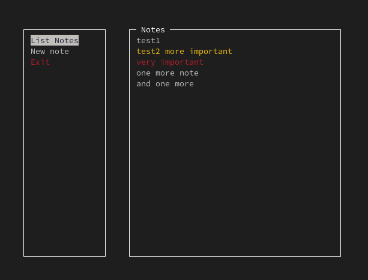

# Notes App

## Overview
This is a simple notes app that allows you to add, remove, list and read notes.  
It uses the file system to store the notes.

## Features
- Create new notes with specified priority levels.
- Edit existing notes, including changing priority and modifying content.
- Delete notes from the list.
- List all notes with their priorities and content without the "UI"

## Dependencies
[//]: <> (ncurses and native c libraries)
- ncurses

## Compilation
To compile the program, simply run the following command in the root directory of the project:

> [!WARNING]  
> Remember to install the [dependencies](#dependencies) before compiling the program.

```bash
make
```

## Usage
To run the program, simply run the following command in the root directory of the project:

```bash
./notes_app
```

## Contributing
Feel free to contribute to this project by creating a pull request.

